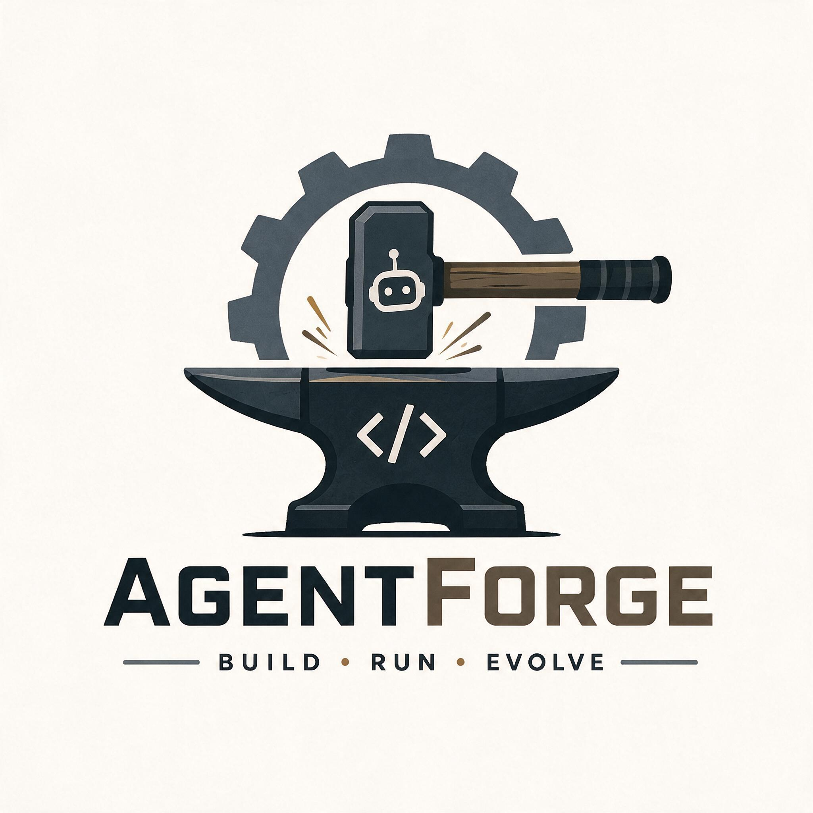

# AgentForge



A single-binary runtime that turns a YAML file into a running AI agent with MCP tools, an HTTP API, and human approval gates — on your own machine, no cloud account required.

## Quickstart

```
ollama pull qwen2.5-coder:14b
ollama serve

go build -o agentforge ./cmd/agentforge
./agentforge run examples/minimal.yaml -m "what tools do you have?"
```

No signup, no API key, nothing to configure — the config file *is* the agent.

## Why

Every run is a persisted state machine, not a `for` loop: state, messages, and every tool call live in SQLite from the first line of code. That's what makes the rest of this possible without a rewrite —

- **Resumable.** Kill the process mid-run and it picks back up exactly where it left off.
- **Inspectable.** `agentforge runs get <id>` shows the full trace: every message (with its token cost and latency), every tool call (with how long it took), who approved it, what came back. `agentforge runs stats` aggregates that across every run: success rate, avg turns, tool-failure rate, token spend.
- **Gated.** Put a tool behind `approvals.require` and the run pauses until a human says yes — denial doesn't kill the run, it feeds an error back to the model so it can try something else.

```
$ agentforge chat examples/everything-demo.yaml
chatting with everything-demo (ctrl+c to quit)
you: what's the sum of 2 and 40?
agent: calling everything.get-sum({"a":2,"b":40})

approval needed (1/1): everything.get-sum
  args: {"a":2,"b":40}
[y]es  [n]o  [e]dit  [a]pprove all remaining
```

`e` lets you fix sloppy arguments before they run — the thing that makes a 14B local model actually survivable as a tool caller.

## Agent config

```yaml
name: github-assistant

model:
  provider: ollama              # ollama | anthropic | openai | gemini
  name: qwen2.5-coder:14b
  temperature: 0.2
  # api_key: ${ANTHROPIC_API_KEY}   # anthropic/openai/gemini; same ${VAR} resolution as GITHUB_TOKEN below
  # base_url: https://api.groq.com/openai/v1   # openai only — any OpenAI-compatible endpoint
  #                                             # (Groq, Together, xAI/Grok, vLLM, llama.cpp, ...); api_key
  #                                             # is only required when base_url is left unset
  #                                             # (gemini always requires api_key — no self-hosted/no-auth case)

instructions: |
  You are a GitHub assistant. Use the available tools to answer questions
  about repositories.

mcp:
  - name: github
    transport: stdio
    command: ["npx", "-y", "@modelcontextprotocol/server-github"]
    env:
      GITHUB_TOKEN: ${GITHUB_TOKEN}   # resolved from the environment at load time

tools:
  - "github.*"                  # namespaced glob filter over the MCP tool list

approvals:
  mode: annotated                # never | annotated | always
  require:
    - "github.create_issue"
  auto_approve:
    - "github.get_*"
  timeout: 30m
  on_timeout: deny

# output:                         # optional: validate the final answer against a JSON Schema
#   schema: ./schemas/issue-list.json
#   on_invalid: retry              # retry | fail
#   max_retries: 2

# tool_policy:                     # optional: bound how long a single tool call may run
#   timeout: 30s                   # default for every tool; absent = unbounded (today's behavior)
#   on_timeout: error              # error (default, feed it back to the model) | fail (end the run)
#   overrides:                     # ordered — first matching pattern wins
#     - tools: ["github.*"]
#       timeout: 90s

limits:
  max_turns: 10
  max_tokens: 4096
```

Unknown keys are load errors, not silently ignored typos. A missing `${GITHUB_TOKEN}` (or `${ANTHROPIC_API_KEY}`) fails at load time with a clear message, not the first time a tool tries to use it — and `provider: anthropic`/`provider: openai`/`provider: gemini` without an `api_key` fails the same way, before any request goes out (an `openai` config with `base_url` set is the one exception — see `examples/openai.yaml`, or `examples/anthropic.yaml`/`examples/gemini.yaml` for the matching Anthropic/Gemini configs). See `examples/minimal.yaml` and `examples/everything-demo.yaml` for working configs — the latter uses the public `@modelcontextprotocol/server-everything` reference server, so it runs with zero credentials. Point any of them at Anthropic, OpenAI, or Gemini instead of Ollama by swapping `model.provider`/`model.name`/`model.api_key`; nothing else in the config changes. `examples/github-assistant.yaml` is this config, runnable as-is with a real `GITHUB_TOKEN`.

## Real agents

Configs against real, credential-free MCP servers, for actually using this rather than kicking the tires:

```
export AGENTFORGE_FS_ROOT=$(pwd)
./agentforge chat examples/filesystem-assistant.yaml   # @modelcontextprotocol/server-filesystem, writes gated behind approval

export AGENTFORGE_MEMORY_PATH=/tmp/notes.json
./agentforge run examples/notes-assistant.yaml -m "remember that I like tea"   # @modelcontextprotocol/server-memory, ungated
./agentforge run examples/codebase-notes.yaml -m "what does this repo do?"     # both servers above, at once — see below

./agentforge run examples/weather.yaml -m "what's the weather in Lisbon?"      # mcp-server-fetch + Open-Meteo, no key
./agentforge run examples/article-digest.yaml -m "digest https://modelcontextprotocol.io/introduction"   # same server, structured output

./agentforge run examples/weather-http.yaml -m "what's the weather in Lisbon?"  # same agent, zero MCP servers — see below
./agentforge run examples/repo-assistant.yaml -m "find every TODO in this repo"  # pauses for approval before running rg
./agentforge run examples/notifier.yaml -m "notify topic agentforge-demo titled Hi saying it works"  # a POST tool_definitions tool — see below
```

The filesystem/notes pair makes a deliberate contrast: the filesystem agent gates every mutating tool (`write_file`, `edit_file`, `move_file`, `create_directory`) behind `approvals.require`; the notes agent has no `approvals` section at all, because gating writes to a local knowledge-graph file would just be friction. `codebase-notes.yaml` puts both of those servers in one config instead of picking one — `fs.*` and `memory.*` are namespaced by each server's own `mcp: name`, so there's nothing to reconcile even though "read a file" and "save a note" come from two unrelated processes; it reads files (read-only tools only, no write/edit/move/create) and records what it learned in the memory graph for a later run to recall.

The weather and digest agents both use the official reference fetch server, which is Python rather than npm — install `uv` once (`curl -LsSf https://astral.sh/uv/install.sh | sh`) and `uvx` runs it with no separate install step. They also make their own contrast, over the same server: `weather.yaml` passes `--ignore-robots-txt` because Open-Meteo's API disallows crawlers by default even though it's a free, key-less API meant for exactly this kind of programmatic call; `article-digest.yaml` fetches whatever URL a user hands it, so it deliberately leaves that flag off and honors each site's robots.txt like a normal browser would.

`weather-http.yaml` is the same agent as `weather.yaml` with no MCP server at all — see "Defining your own tools" below for why. `repo-assistant.yaml` is the `command:` counterpart: it wraps `rg` and `git log` directly, and demonstrates the approval gate every `command:`-backed tool gets by default. `notifier.yaml` is the third corner of `http:` tool_definitions neither of those cover: a `method: POST` with a templated `body:` and header, posting to [ntfy.sh](https://ntfy.sh) — a free, no-signup push-notification service. A topic name is an unauthenticated public channel, not a secret, so pick something distinctive rather than something you'd mind a stranger guessing.

## Defining your own tools

Every tool an agent can call comes from one of two places: an MCP server (`mcp:` +
`tools:` as a namespaced glob filter over what it advertises), or a `tool_definitions:`
block that declares the tool directly in the config — no server process, no extra
dependency. Reach for a definition when a tool is "make one HTTP call" or "run one
command"; reach for an MCP server when you want something stateful, reusable across
agents, or that exposes many tools behind one connection.

A definition has a `name`, `description`, and `input_schema` — the model sees these
exactly as it would an MCP tool — plus exactly one backend:

```yaml
tool_definitions:
  - name: weather.current
    description: Current conditions for a latitude/longitude.
    input_schema:
      type: object
      required: ["latitude", "longitude"]
      properties:
        latitude: {type: number}
        longitude: {type: number}
    http:                                    # OR command: — never both
      url: https://api.open-meteo.com/v1/forecast
      query:
        latitude: "{{.latitude}}"            # every string field here is a text/template
        longitude: "{{.longitude}}"          # against the tool call's input
        current: temperature_2m,weather_code

  - name: repo.grep
    description: Search the repository for a literal pattern.
    input_schema:
      type: object
      required: ["pattern"]
      properties:
        pattern: {type: string}
    command:
      argv: ["rg", "--json", "--", "{{.pattern}}"]   # exec'd directly — no shell, ever
```

A few things worth knowing before writing one:

- **Templates use `missingkey=error`**: a placeholder the model's input doesn't cover is a
  tool-call error, not a silent empty string — which also means a field referenced in a
  template should be `required` in `input_schema`, or an omitted optional field breaks the
  call. `examples/repo-assistant.yaml`'s `repo.log` requires `path` for exactly this reason.
- **`command:` runs `argv` directly via `exec.Command`** — a rendered value containing
  `;`, spaces, or `$(...)` arrives as one inert argument, never shell-interpreted. `argv[0]`
  (the binary) must be a literal in the config; only later elements may be templated. The
  child process gets a minimal environment (`PATH`/`HOME`/`LANG`), not the daemon's full
  one — add anything else explicitly via `command.env`.
- **`command:`-backed tools are approval-gated by default**, regardless of
  `approvals.mode` — handing the model process execution with no gate isn't a safe
  default. Opt a specific one out with `approvals.auto_approve` (see `repo.log` in
  `examples/repo-assistant.yaml`, which does this because it's read-only in practice).
  `http:`-backed tools follow the normal approval rules.
- **A definition's `url` host must be literal** — a placeholder there would let the model
  retarget the request at an arbitrary server. Placeholders in the path and query are fine.
- **`http:` isn't only GET+query** — `method` (default `GET`), `headers`, and `body` are all
  templated the same way as `query:`, so a `method: POST` with a templated `body:` works
  exactly like you'd expect. See `examples/notifier.yaml`.
- Both backends respect `tool_policy` timeouts and truncate their output the same way
  (default 64 KiB, `max_response_bytes`/`max_output_bytes` to change it).

`examples/weather-http.yaml` and `examples/repo-assistant.yaml` are full working
configs — the `http:` and `command:` sides of the same feature. `examples/notifier.yaml`
adds the `method:`/`body:` corner neither of those exercises.

## Structured output

Point `output.schema` at a JSON Schema file and a run's final answer (not tool calls — a
turn that calls a tool is never validated) has to conform to it before the run completes:

```
./agentforge run examples/structured-output.yaml -m "a story about a lighthouse keeper"
```

`examples/structured-output.yaml` has no tools, to keep the example minimal — for the more
common shape, tools *and* a schema together, see `examples/article-digest.yaml`, which
fetches a page and answers with structured JSON.

If the model's answer violates the schema, the error is fed back as a normal user turn and
the model gets another shot — the same self-correction loop already used for a malformed
tool call, sharing its retry counter (see `runs get`, which shows both kinds of retry in
the trace by their message shape). Three numbers interact:

| | scope | default |
|---|---|---|
| `limits.max_turns` | every model call in the run | 10 |
| `output.max_retries` | consecutive schema violations | 2 |
| (tool-call repair, not configurable) | consecutive malformed tool calls | 2 |

Every retry burns a turn, so `max_turns` is the hard ceiling regardless of how generous
`max_retries` is — a run that keeps violating its schema past `max_turns` fails with "max
turns exceeded," not a schema error. `max_retries: 0` behaves like `on_invalid: fail`: one
attempt, no second chance.

Native enforcement varies by provider: Ollama enforces the schema (via `format`) only when
the agent has no tools registered — constrained decoding makes tool calls impossible on
that turn, so a tool-using agent on Ollama always takes the fallback below, same as
Anthropic and Gemini (neither has native support yet — Gemini's `responseSchema` is an
OpenAPI-subset dialect that would need its own translation layer). OpenAI is the exception: `response_format`
composes with `tools` on the same request, so an OpenAI-backed agent gets native
enforcement *and* tool use together — the one combination nothing else here can do yet.
Wherever native enforcement doesn't apply, validation happens by inspecting the model's
text after the fact instead — same guarantee, one extra round trip on a violation.

**Structured output only gates one-shot runs** (`run`, the HTTP API) — `chat` never
validates, since forcing every conversational reply to conform to a schema would make an
interactive session unusable.

A relative `output.schema` path resolves against the config file's own directory — but
only when the config was loaded from a file directly (`run`, `chat`). A run resumed from
the daemon or `runs approve`/`resume` reconstructs its config from the copy stored in
SQLite, which has no source directory; use an absolute path if the agent might run that
way. The error message says so if you get it wrong.

## Tool timeouts

With no `tool_policy` block, a tool call has no deadline of its own — a hung MCP server (a
stdio child that accepts a request and never answers) wedges the run forever, with no
config knob to bound it. `tool_policy` closes that gap:

```yaml
tool_policy:
  timeout: 30s          # default applied to every tool call
  on_timeout: error      # error (default) | fail
  overrides:              # ordered — first matching pattern wins
    - tools: ["github.*"]
      timeout: 90s
    - tools: ["render.video", "build.*"]
      timeout: 10m
```

`on_timeout: error` (the default) feeds the timeout back to the model as a tool-result
error, exactly like a denied call — the run survives and the agent gets to try something
else. `on_timeout: fail` ends the run instead, the same as an exhausted schema-retry
budget. There is no implicit default: a config with no `tool_policy` at all keeps every
tool unbounded, unchanged from before this existed — opting in is explicit.

A timed-out call also forces the MCP server it belongs to to reconnect on its next use
(`internal/mcp` drops any session that returns an error, deadline included — abandoning a
request mid-flight would desync a stdio JSON-RPC stream), so a tool that repeatedly times
out restarts its server each time.

`examples/weather.yaml` (and its `tool_definitions:`-based twin, `examples/weather-http.yaml`)
are live examples: both set `tool_policy.timeout: 20s` around a network call, exactly the
kind of call that can hang. Drop it to `1ms` and rerun to watch a run survive its own tool
timing out — `runs get` shows the call as an error reading `tool "web.fetch" timed out
after 1ms` (or the equivalent for `geo.search`) instead of the run hanging or failing.

The `overrides:` shown above isn't hypothetical either — `examples/github-assistant.yaml`
uses that exact `github.*`/`90s` override for real, because a GitHub API call is a slower
round trip than the 30s default.

`limits.timeout` bounds the whole run, not just a single tool call: it's a deadline anchored to
the run's creation time, checked by every `Step` call regardless of whether the run is currently
waiting on the model or a tool. A run that outlives it ends `failed` with `run exceeded its time
limit` (or `cancelled`, if the same deadline fired as an external cancellation instead) — either
way the run always lands in a terminal state, never stranded.

## Evals

The reliability machinery above — repair loops, approval gates, tool-call retries —
is only as credible as the evidence that it actually works. `agentforge eval` runs
a suite of scripted conversations against a real agent config and checks the
outcome against an `expect:` block, using the same data every run already persists
(`runs.state`, `tool_calls.tool_name`, `runs.repair_count`, ...) rather than new
runtime machinery:

```yaml
# examples/evals/weather.yaml
agent: ../weather-http.yaml
cases:
  - name: resolves a city to coordinates
    input: "What's the weather in Lisbon?"
    expect:
      final_state: completed
      tool_called: ["geo.search", "weather.current"]
      output_contains: ["Lisbon"]
      max_turns: 6
      no_repairs: true
```

```
agentforge eval examples/evals                 # every suite, --replay (the default): scripted model responses, no API key
agentforge eval examples/evals/weather.yaml --live --model qwen3:8b --model qwen3:14b   # a real model, once per --model, as a comparison
agentforge eval examples/evals/weather.yaml --live --record                              # save what --live produced as the replay fixture
```

`--replay` fakes only the model leg (from a fixture under `testdata/fixtures/`) —
tool calls are real, so `weather.yaml`'s case above makes an actual (free, keyless)
call to Open-Meteo every time it runs; this is what CI runs on every push. `--live`
drives a real model through the agent config's own provider, or `--model`'s
override(s) — repeatable, so one command produces a matrix across local and hosted
models. See `docs/DESIGN.md` section 12.

## CLI

```
agentforge run <agent.yaml> -m "<message>" [--server URL]        # one-shot; embedded engine, or a running daemon
agentforge chat <agent.yaml>                                      # interactive REPL with approval prompts
agentforge serve [--addr 127.0.0.1:8080]                          # the HTTP daemon
agentforge agents list|get|delete [--server URL]                   # local store or daemon
agentforge runs list [--agent NAME] [--limit N] [--server URL]     # most recent first
agentforge runs get <id> [--server URL]                            # full trace: messages, tool calls, who approved
agentforge runs approve|deny <id> <call-id> [--reason TEXT]        # decide a pending call and continue the run
agentforge runs resume <id> [--server URL]                         # continue a run whose calls are already decided
agentforge runs cancel <id> [--server URL]                         # stop a non-terminal run immediately
agentforge runs stats [--agent NAME]                                # success rate, avg turns/tool calls, token spend (local --db only)
agentforge eval <suite.yaml | dir> [--live [--model P]... [--record]]  # run a scripted eval suite; see "Evals" below
```

`run` and the `agents`/`runs` commands work standalone against a local SQLite file (`~/.agentforge/agentforge.db` by default, override with `--db`), or against a running daemon via `--server` — same config, same behavior, either way. `agentforge run` exits non-zero when the run fails or hits an unhandled error, so it's safe to chain in a script; a run that pauses for approval prints the pending call IDs and exits 0 — decide with `runs approve`/`deny`.

`run`, `runs approve`, `runs deny`, and `runs resume` all take `-m`/`--message` as `@path`
to read it from a file instead of the command line (`run script-agent.yaml -m
@beat-sheet.txt` — `-m` itself is `run`-only, since the others are just continuing an
in-progress run), and `--output-format json --output PATH` to write a
`{run_id, state, output, tool_calls_count, duration_ms}` envelope instead of the usual
human-readable trace — `output` is a nested JSON value when the agent's `output.schema` is
set, a plain string otherwise:

```
./agentforge run examples/structured-output.yaml -m @prompt.txt --output-format json --output spec.json
jq .output.beats spec.json
```

In JSON mode, progress lines move to stderr so stdout carries only the envelope and can be
piped straight into `jq`; in text mode (the default) nothing changes.

## HTTP API

`agentforge serve` binds `127.0.0.1:8080` by default. Auth is opt-in:
`--auth-token TOKEN` requires `Authorization: Bearer TOKEN` on every request but
`/healthz`; with no token set, every request is unauthenticated, which is only a
reasonable posture while `--addr` stays loopback-only (`serve` logs a warning at
startup if it isn't). Set a token before pointing `--addr` at anything else.

```
POST   /v1/agents                    # create/update from a YAML body
GET    /v1/agents                    GET /v1/agents/{name}    DELETE /v1/agents/{name}
GET    /v1/agents/{name}/tools       # resolved, filtered, namespaced tool list

POST   /v1/agents/{name}/run         # 200 with a result, or 202 with pending approvals
POST   /v1/agents/{name}/stream      # same, but Server-Sent Events: token/tool_call/tool_result as they happen
GET    /v1/runs                      # most recent first; ?agent=name and ?limit=n
GET    /v1/runs/{id}                 # full trace
POST   /v1/runs/{id}/approve         # {call_id, decision: "approved"|"denied", reason?}
POST   /v1/runs/{id}/resume          # drive the run forward after approving/denying
POST   /v1/runs/{id}/cancel          # stop a non-terminal run immediately; 409 if it's already terminal

GET    /healthz
```

## Go SDK

Every other entry point — the CLI, the HTTP daemon — is a thin wrapper over the
same `internal/agent.Build` + `internal/runtime.Engine` + `internal/store` this
package uses; `pkg/agentforge` is that wiring, exported, so an agent can be run
in-process from Go code without a daemon:

```go
import "agentforge/pkg/agentforge"

ag, err := agentforge.Load("agent.yaml")
if err != nil {
    log.Fatal(err)
}
defer ag.Close()

run, err := ag.Run(context.Background(), "Find the latest issues")
if err != nil {
    log.Fatal(err)
}
fmt.Println(run.Output)
```

A run that stops at `run.State == "awaiting_approval"` is resolved the same way the
CLI resolves it — `ag.Approve`/`ag.Deny` a pending call (`run.Pending`), then
`ag.Resume` — and `ag.Cancel` stops a non-terminal run immediately. `WithEvents`
subscribes to the same token/tool_call/tool_result events `agentforge chat` and the
HTTP API's `/stream` endpoint use. Runs started through the SDK use the same local
SQLite store as the CLI (`~/.agentforge/agentforge.db` by default, override with
`agentforge.WithDB`), so they show up in `agentforge runs list` and vice versa.

## What's here (and what isn't)

Built so far: the persisted run state machine with tool-call repair, an MCP client with process supervision and crash recovery, YAML config with env interpolation, the HTTP daemon, the full CLI (including driving a run through an approval gate and back, and listing runs, from the command line — not just from `chat`), approval gates with timeouts, per-tool timeouts (`tool_policy`) with pattern overrides, in-config tool definitions (`tool_definitions:` — HTTP requests or exec'd commands, no MCP server required) with a default approval gate on command-backed ones, a chat REPL for driving all of it interactively, SSE streaming on `/v1/agents/{name}/stream`, four providers behind one `Provider` interface — Ollama, Anthropic, OpenAI, and Gemini (native `generateContent`, so its thinking models' function-call `thoughtSignature` round-trips correctly across multi-turn tool loops — plus anything OpenAI-compatible via `base_url`: Groq, Together, xAI/Grok, vLLM, llama.cpp, ...) — with the same approval/denial/resume flow regardless of which; schema-validated structured output (`output.schema`) with automatic self-correction, native alongside tool use on OpenAI, native with no tools on Ollama, a validate-and-retry fallback everywhere else; and structured run output (`--output-format json`, `--output PATH`, `-m @file`) for scripting `run`/`runs approve|deny|resume`.

Not yet: streaming isn't wired into the CLI (`run`/`chat` still get one atomic result), native structured output on Anthropic (forced tool-use — fallback validation works today, just costs an extra round trip on a violation), OpenAI's `strict:true` schema mode (would need a conformance check against the schema subset it requires), and everything explicitly deferred — dashboard, Kubernetes, multi-tenancy, Postgres/Redis, RAG, multi-agent workflows, and a visual builder. `tool_definitions:` covers the narrow one-request/one-command case; MCP remains the extension mechanism for anything stateful or multi-tool, so there's still no separate plugin SDK beyond it. None of that is missing by accident.

## Building

```
CGO_ENABLED=0 go build -o agentforge ./cmd/agentforge
```

Pure Go throughout (including SQLite, via `modernc.org/sqlite`) — no cgo, so this produces a genuinely static, single-file binary that runs on a machine with no Go toolchain installed.
